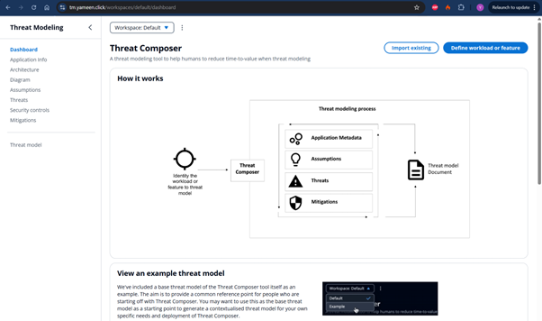

# ECS Project — Threat Composer on AWS

A containerised web application deployed to AWS using ECS Fargate, with full infrastructure-as-code via Terraform and automated CI/CD pipelines using GitHub Actions.

---

## Tools & Technologies

| Category | Tool / Service |
|---|---|
| Application | Threat Composer (React/Node.js) |
| Containerisation | Docker, Nginx |
| Container Registry | Amazon ECR |
| Orchestration | Amazon ECS (Fargate) |
| Infrastructure as Code | Terraform |
| Networking | AWS VPC, ALB, Route 53 |
| TLS/HTTPS | AWS Certificate Manager (ACM) |
| CI/CD | GitHub Actions |
| State Management | S3 + DynamoDB |
| Auth (CI/CD) | AWS OIDC (no static keys) |

---

## Directory Structure

```
ECS-Project-YR/
├── app/                        # Threat Composer application source
├── Dockerfile                  # Multi-stage Docker build
├── nginx.conf                  # Nginx config for serving the app
├── .dockerignore
├── .gitignore
├── infra/
│   ├── main.tf                 # Root module — wires all modules together
│   ├── variables.tf
│   ├── outputs.tf
│   ├── provider.tf
│   ├── backend.tf              # S3 remote state config
│   └── modules/
│       ├── vpc/
│       ├── ecs/
│       ├── alb/
│       ├── ecr/
│       └── acm/
└── .github/
    └── workflows/
        ├── build.yaml          # Docker build & push pipeline
        └── deploy.yaml         # Terraform deploy pipeline
```

---

## Key Infrastructure

- VPC with public and private subnets across two availability zones (`eu-west-2a`, `eu-west-2b`)
- NAT gateway in the public subnet allowing ECS tasks in private subnets to make outbound calls (e.g. pulling images from ECR) without being publicly exposed
- ECS Fargate cluster running containers in private subnets with no EC2 instances to manage
- Application Load Balancer (ALB) in public subnets, handling HTTPS traffic and redirecting HTTP to HTTPS
- ACM certificate for TLS, validated via Route 53 DNS records
- Route 53 A record pointing `tm.yameen.click` to the ALB
- ECR repository storing Docker images tagged by commit SHA and `latest`
- IAM roles for ECS task execution and GitHub Actions OIDC authentication
- S3 bucket and DynamoDB table for Terraform remote state and locking

---

## Live URL

**[https://tm.yameen.click](https://tm.yameen.click)**



---

## How to Reproduce

### Prerequisites

- AWS CLI configured with appropriate permissions
- Terraform v1.x installed
- Docker installed
- A registered domain with a Route 53 hosted zone

### 1. Local App Setup

Clone the repository and install dependencies:

```bash
git clone https://github.com/YameenRashid/ECS-Project-YR.git
cd ECS-Project-YR/app
yarn install
yarn start
```

The app will be available at `http://localhost:3000`.

---

### 2. Docker

The Dockerfile uses a **multi-stage build** to keep the final image small and secure.

**Stage 1 — Build:** Uses `node:20-alpine` to install dependencies and build the React app with `yarn build`. This stage produces the static build output but is not included in the final image.

**Stage 2 — Production:** Uses `nginx:alpine` to serve the static files. Nginx is configured to listen on port 8080, serve the React app, and expose a `/health` endpoint returning `{"status":"ok"}`. A non-root user (`appuser`) is created and given ownership of the necessary Nginx directories, keeping the container secure.

To build and run locally:

```bash
docker build -t threatmod .
docker run -p 8080:8080 threatmod
curl http://localhost:8080/health
```

To push to ECR:

```bash
aws ecr get-login-password --region eu-west-2 | docker login --username AWS --password-stdin <account_id>.dkr.ecr.eu-west-2.amazonaws.com
docker tag threatmod:latest <account_id>.dkr.ecr.eu-west-2.amazonaws.com/threatmod:latest
docker push <account_id>.dkr.ecr.eu-west-2.amazonaws.com/threatmod:latest
```

---

### 3. Terraform

Infrastructure is fully defined as code using Terraform, organised into reusable modules.

**Modules:**

- `vpc` — VPC, public/private subnets, internet gateway, NAT gateway, public and private route tables
- `acm` — ACM certificate with Route 53 DNS validation
- `alb` — Application Load Balancer, security groups, target group, listeners, Route 53 A record
- `ecr` — ECR repository for Docker images
- `ecs` — ECS cluster, task definition, Fargate service, IAM execution role, security groups

**Remote State:**

Terraform state is stored remotely in S3 with DynamoDB locking, so both local runs and CI/CD pipelines share the same state:

```hcl
terraform {
  backend "s3" {
    bucket         = "threatmod-terraform-state"
    key            = "prod/terraform.tfstate"
    region         = "eu-west-2"
    dynamodb_table = "terraform-state-lock"
    encrypt        = true
  }
}
```

To deploy the infrastructure:

```bash
cd infra
terraform init
terraform plan
terraform apply
```

---

### 4. CI/CD Pipelines

Two separate GitHub Actions workflows automate the build and deployment process.

**`build.yaml` — Docker Build & Push**

Triggers on any push to `main` that changes files in `app/`, or manually via `workflow_dispatch`. It:

1. Checks out the code
2. Authenticates with AWS using OIDC (no static keys stored)
3. Logs into ECR
4. Builds the Docker image and tags it with both the commit SHA and `latest`
5. Pushes both tags to ECR

**`deploy.yaml` — Terraform Deploy**

Triggers on any push to `main` that changes files in `infra/`, or manually via `workflow_dispatch`. It:

1. Checks out the code
2. Authenticates with AWS using OIDC
3. Sets up Terraform
4. Runs `terraform init` — connects to the S3 remote backend
5. Runs `terraform plan` — previews changes
6. Runs `terraform apply -auto-approve` — applies changes
7. Runs a health check against `https://tm.yameen.click/health` — fails the pipeline if the app is unhealthy

**OIDC Authentication**

Neither pipeline uses static AWS access keys. Instead, an IAM OIDC identity provider trusts GitHub Actions tokens, allowing the pipeline to assume an IAM role scoped specifically to the `YameenRashid/ECS-Project-YR` repository. This is significantly more secure than storing long-lived credentials in GitHub secrets.

To trigger either pipeline manually, go to the **Actions** tab in GitHub, select the workflow, and click **Run workflow**.

